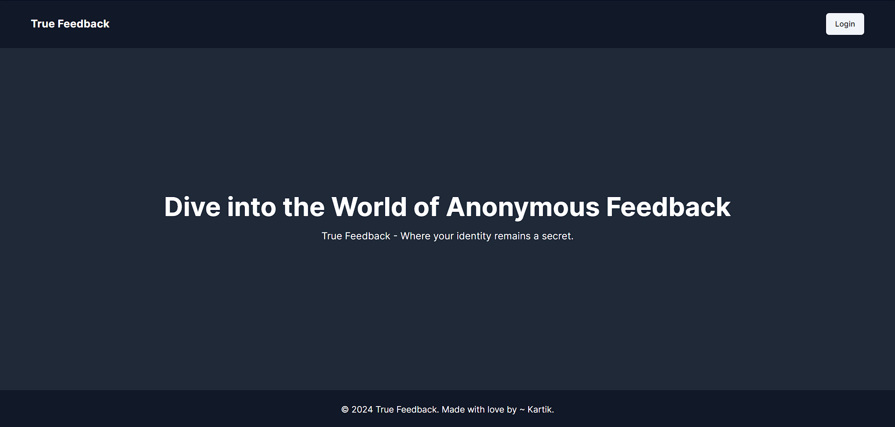
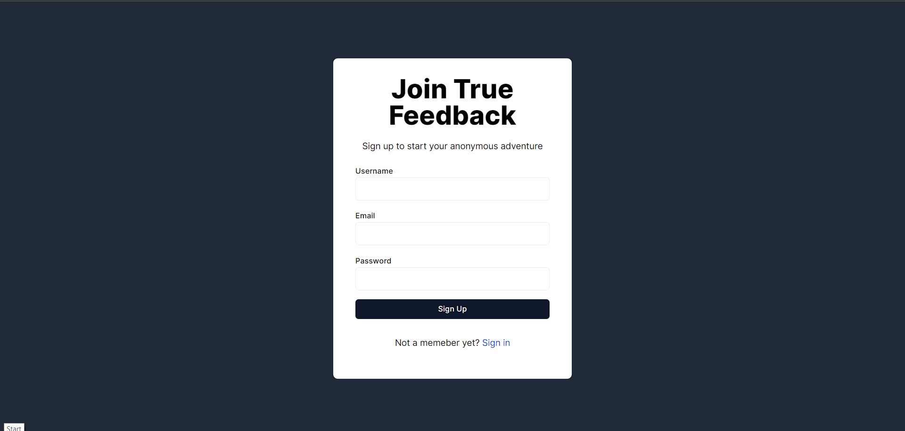
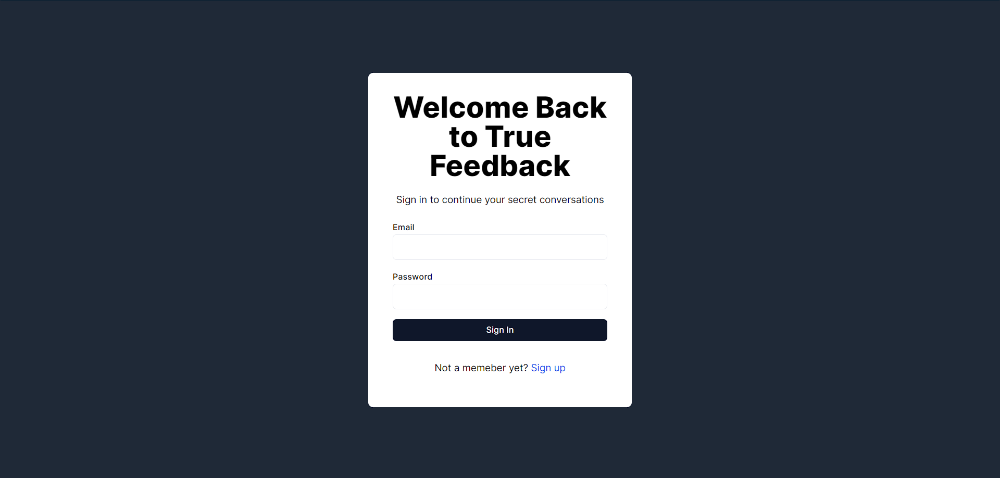
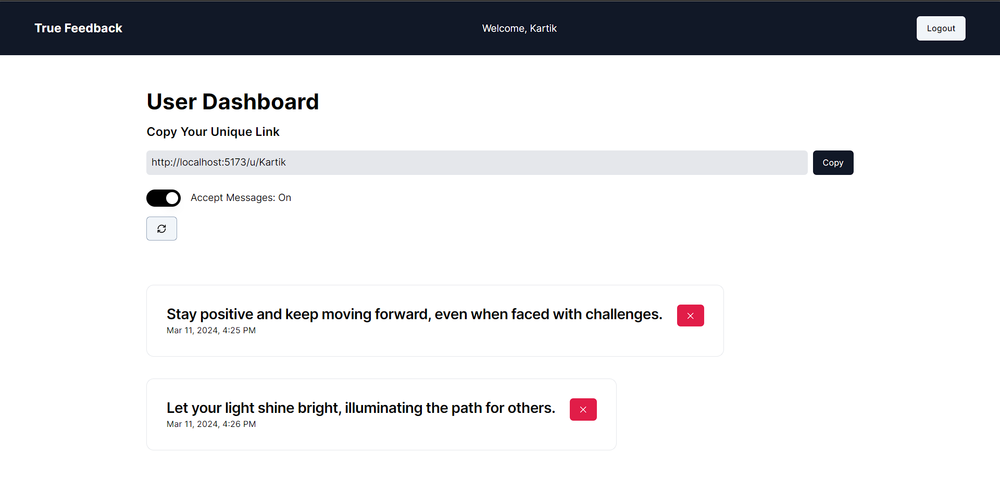

# TrueFeedback

## Overview

This is a Fullstack MERN application that allows users to create accounts, authenticate, and get a link to share with their friends to get anonymous messages. It uses React for the frontend, Express and Node.js for the backend, MongoDB for the database, and TailwindCSS for the user interface.

### Landing Page


### Sign-Up Page


### Sign-In Page


### User Dashboard


### Public Profile


## Authentication

- The app uses JWT for authentication. Users can sign up and log in securely.
- Authentication routes are available in the `/server/routes/auth.js` file.

## View and Delete Messages

- User can see the messages sent to them and delete the messages.
- User can also set the status of message acceptance.

## Send Messages

- User can share the link and set the message acceptance true to enable recieving anonymous messages from the person whome they have given the link.
- Website also offers some message suggestions which can be used.

## Prerequisites

- Node.js and npm installed on your machine.
- MongoDB database setup (you can use a local or cloud-based MongoDB instance).

## Getting Started

1. Clone the repository:

```bash
git clone https://github.com/Kartik213/TrueFeedback
cd TrueFeedback
```

2. Install dependencies for both the server and client:

```bash
cd server
npm install
cd ../client
npm install
```

3. Configure Environment Variables:
   Create a `.env` file in the `server` directory with the following variables:

```bash
PORT=3001
MONGO_URL=your_mongodb_uri
JWT_SECRET=your_secret_key
```

4. Start the server:

```bash
cd ../server
npm start
```

The server will run on port 3001 by default. 

5. Start the client:

```bash
cd ../client
npm run dev
```

The React development server will start, and the app will be accessible at `http://localhost:5173`.

## Deployment

- To deploy the app, you can use platforms like Heroku for the server and Vercel or Netlify for the client.
- Don't forget to configure environment variables on your deployment platforms.

## Project Structure

- `/client`: Frontend React application.
- `/server`: Backend Node.js and Express application.
- `/server/controllers`: contains function for different operations.
- `/server/middleware`: contains middleware.
- `/server/models`: MongoDB models for User and Post.
- `/server/routes`: Express routes for authentication, posts and user.
- `/client/src/components`: React components for the frontend.
- `/client/src/pages`: Contains different pages.

## Acknowledgments

- Thanks to the open-source community for providing tools and resources that made this project possible.
